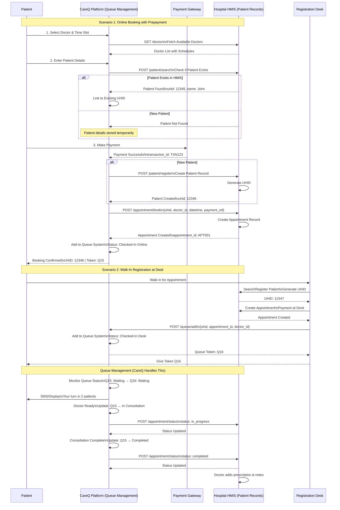
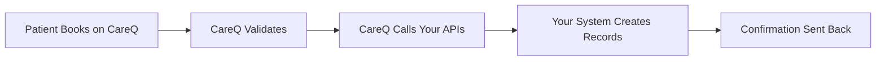

# CareQ Third-Party Integration API Specification

**Version:** 1.0.0
**Last Updated:** December 10, 2025
**Integration Type:** Webhook/REST API

---

## Table of Contents

1. [Overview](#overview)
2. [Authentication](#authentication)
3. [General Requirements](#general-requirements)
4. [API Endpoints Required](#api-endpoints-required)
5. [Data Models](#data-models)
6. [Error Handling](#error-handling)
7. [Webhook Security](#webhook-security)
8. [Testing & Validation](#testing--validation)

---

## Overview

This document specifies the API endpoints that the third-party system must implement to receive synchronized data from CareQ. When a patient books an appointment on CareQ, the system will automatically sync the following data to your system via webhook calls:

* **Patient (Customer) Information**
* **Doctor (Provider) Information**
* **Appointment Details**
* **Service/Treatment Information**

## Integeration Architecture



**Note:** Queue management functionality is NOT synced and will be handled exclusively on CareQ's side.

### Integration Flow



---

## Authentication

### Method: Bearer Token Authentication

All API requests from CareQ will include an authorization header:

```http
Authorization: Bearer YOUR_SECRET_TOKEN
```

**Requirements:**

* You must provide CareQ with a **secret API token**
* Token must be at least 32 characters long
* Token should be unique per clinic
* Implement token validation on all endpoints

### Optional: API Key in Header

```http
X-API-Key: YOUR_API_KEY
```

### Optional: Secret Header Validation

For additional security, you can provide a secret header key-value pair:

```http
X-Webhook-Secret: your-secret-value
```

---

## General Requirements

### Base URL

```
https://your-domain.com/api/v1/careq-sync/
```

### Request Format

* **Content-Type:** `application/json`
* **Character Encoding:** `UTF-8`
* **HTTP Method:** `POST` for all create/update operations

### Response Format

All responses must return JSON with the following structure:

```json
{
  "success": true,
  "message": "Record created successfully",
  "data": {
    "id": "your-internal-id",
    "external_id": "careq-record-id"
  },
  "timestamp": "2025-12-10T10:30:00Z"
}
```

### HTTP Status Codes

| Code | Meaning              | Usage                             |
| ---- | -------------------- | --------------------------------- |
| 200  | Success              | Record updated successfully       |
| 201  | Created              | New record created                |
| 400  | Bad Request          | Invalid data provided             |
| 401  | Unauthorized         | Invalid or missing authentication |
| 404  | Not Found            | Record not found for update       |
| 409  | Conflict             | Duplicate record exists           |
| 422  | Unprocessable Entity | Validation error                  |
| 500  | Server Error         | Internal server error             |

---

## API Endpoints Required

### 1. Sync Patient (Customer)

**Endpoint:** `POST /api/v1/careq-sync/patient`

**Description:** Creates or updates a patient record in your system.

**Request Headers:**

```http
Content-Type: application/json
Authorization: Bearer YOUR_SECRET_TOKEN
```

**Request Body:**

```json
{
  "careq_id": 12345,
  "clinic_id": "clinic_abc",
  "first_name": "John",
  "last_name": "Doe",
  "email": "john.doe@example.com",
  "phone_number": "9876543210",
  "date_of_birth": "1990-05-15",
  "gender": "male",
  "address": "123 Main Street",
  "city": "Mumbai",
  "state": "Maharashtra",
  "zip_code": "400001",
  "aadhar_number": "1234-5678-9012",
  "spouse_name": "Jane Doe",
  "father_name": "Robert Doe",
  "custom_field_1": "Blood Group: O+",
  "custom_field_2": "Allergies: None",
  "custom_field_3": null,
  "custom_field_4": null,
  "custom_field_5": null,
  "notes": "Regular patient, prefers morning appointments",
  "timezone": "Asia/Kolkata",
  "language": "en-US",
  "created_at": "2025-12-10T10:00:00Z",
  "updated_at": "2025-12-10T10:00:00Z"
}
```

**Response (Success - 201):**

```json
{
  "success": true,
  "message": "Patient created successfully",
  "data": {
    "id": "your-patient-id-789",
    "careq_id": 12345,
    "sync_status": "synced"
  },
  "timestamp": "2025-12-10T10:01:00Z"
}
```

**Response (Update - 200):**

```json
{
  "success": true,
  "message": "Patient updated successfully",
  "data": {
    "id": "your-patient-id-789",
    "careq_id": 12345,
    "sync_status": "updated"
  },
  "timestamp": "2025-12-10T10:01:00Z"
}
```

**Response (Error - 422):**

```json
{
  "success": false,
  "message": "Validation failed",
  "errors": {
    "phone_number": ["Phone number must be 10 digits"],
    "email": ["Email format is invalid"]
  },
  "timestamp": "2025-12-10T10:01:00Z"
}
```

**Field Requirements:**

| Field         | Type    | Required | Max Length | Notes                      |
| ------------- | ------- | -------- | ---------- | -------------------------- |
| careq_id      | integer | Yes      | -          | Unique CareQ patient ID    |
| clinic_id     | string  | Yes      | 100        | Clinic identifier          |
| first_name    | string  | Yes      | 256        | -                          |
| last_name     | string  | Yes      | 256        | -                          |
| email         | string  | No       | 512        | Must be valid email format |
| phone_number  | string  | Yes      | 10         | 10-digit mobile number     |
| date_of_birth | string  | No       | -          | Format: YYYY-MM-DD         |
| gender        | string  | No       | 10         | male/female/other          |
| address       | string  | No       | 256        | -                          |
| city          | string  | No       | 256        | -                          |
| state         | string  | No       | 256        | -                          |
| zip_code      | string  | No       | 10         | -                          |
| aadhar_number | string  | No       | 20         | Aadhaar card number        |
| spouse_name   | string  | No       | 256        | -                          |
| father_name   | string  | No       | 256        | -                          |
| notes         | text    | No       | -          | Any additional notes       |
| timezone      | string  | No       | 256        | e.g., Asia/Kolkata         |
| language      | string  | No       | 10         | e.g., en-US                |

---

### 2. Sync Doctor (Provider)

**Endpoint:** `POST /api/v1/careq-sync/doctor`

**Description:** Creates or updates a doctor/provider record in your system.

**Request Headers:**

```http
Content-Type: application/json
Authorization: Bearer YOUR_SECRET_TOKEN
```

**Request Body:**

```json
{
  "careq_id": 456,
  "clinic_id": "clinic_abc",
  "first_name": "Dr. Sarah",
  "last_name": "Smith",
  "email": "dr.sarah@clinic.com",
  "phone_number": "9123456789",
  "mobile_number": "9123456789",
  "address": "456 Medical Plaza",
  "city": "Mumbai",
  "state": "Maharashtra",
  "zip_code": "400002",
  "timezone": "Asia/Kolkata",
  "language": "en-US",
  "specialization": "Cardiology",
  "notes": "Available Mon-Fri, 9 AM - 5 PM",
  "is_private": false,
  "created_at": "2025-12-10T09:00:00Z",
  "updated_at": "2025-12-10T09:00:00Z"
}
```

**Response (Success - 201):**

```json
{
  "success": true,
  "message": "Doctor created successfully",
  "data": {
    "id": "your-doctor-id-123",
    "careq_id": 456,
    "sync_status": "synced"
  },
  "timestamp": "2025-12-10T09:01:00Z"
}
```

**Field Requirements:**

| Field          | Type    | Required | Max Length | Notes                       |
| -------------- | ------- | -------- | ---------- | --------------------------- |
| careq_id       | integer | Yes      | -          | Unique CareQ provider ID    |
| clinic_id      | string  | Yes      | 100        | Clinic identifier           |
| first_name     | string  | Yes      | 256        | -                           |
| last_name      | string  | Yes      | 256        | -                           |
| email          | string  | No       | 512        | Must be valid email format  |
| phone_number   | string  | No       | 128        | -                           |
| mobile_number  | string  | No       | 128        | -                           |
| address        | string  | No       | 256        | -                           |
| city           | string  | No       | 256        | -                           |
| state          | string  | No       | 256        | -                           |
| zip_code       | string  | No       | 10         | -                           |
| specialization | string  | No       | 256        | Doctor's specialty          |
| notes          | text    | No       | -          | Any additional notes        |
| is_private     | boolean | No       | -          | Whether provider is private |
| timezone       | string  | No       | 256        | e.g., Asia/Kolkata          |
| language       | string  | No       | 10         | e.g., en-US                 |

---

### 3. Sync Service

**Endpoint:** `POST /api/v1/careq-sync/service`

**Description:** Creates or updates a service/treatment record in your system.

**Request Headers:**

```http
Content-Type: application/json
Authorization: Bearer YOUR_SECRET_TOKEN
```

**Request Body:**

```json
{
  "careq_id": 789,
  "clinic_id": "clinic_abc",
  "name": "General Consultation",
  "duration": 30,
  "price": 500.00,
  "currency": "INR",
  "description": "General medical consultation and check-up",
  "location": "Consultation Room 1",
  "color": "#3498db",
  "category": "Consultation",
  "is_private": false,
  "created_at": "2025-12-10T08:00:00Z",
  "updated_at": "2025-12-10T08:00:00Z"
}
```

**Response (Success - 201):**

```json
{
  "success": true,
  "message": "Service created successfully",
  "data": {
    "id": "your-service-id-555",
    "careq_id": 789,
    "sync_status": "synced"
  },
  "timestamp": "2025-12-10T08:01:00Z"
}
```

**Field Requirements:**

| Field       | Type    | Required | Max Length | Notes                      |
| ----------- | ------- | -------- | ---------- | -------------------------- |
| careq_id    | integer | Yes      | -          | Unique CareQ service ID    |
| clinic_id   | string  | Yes      | 100        | Clinic identifier          |
| name        | string  | Yes      | 256        | Service name               |
| duration    | integer | Yes      | -          | Duration in minutes        |
| price       | decimal | No       | -          | Service price              |
| currency    | string  | No       | 10         | e.g., INR, USD             |
| description | text    | No       | -          | Service description        |
| location    | string  | No       | 256        | Service location           |
| color       | string  | No       | 7          | Hex color code             |
| category    | string  | No       | 256        | Service category           |
| is_private  | boolean | No       | -          | Whether service is private |

---

### 4. Sync Appointment

**Endpoint:** `POST /api/v1/careq-sync/appointment`

**Description:** Creates or updates an appointment record in your system.

**Request Headers:**

```http
Content-Type: application/json
Authorization: Bearer YOUR_SECRET_TOKEN
```

**Request Body:**

```json
{
  "careq_id": 10001,
  "clinic_id": "clinic_abc",
  "patient_careq_id": 12345,
  "doctor_careq_id": 456,
  "service_careq_id": 789,
  "book_datetime": "2025-12-10T10:00:00Z",
  "start_datetime": "2025-12-15T14:00:00Z",
  "end_datetime": "2025-12-15T14:30:00Z",
  "status": "booked",
  "location": "Consultation Room 1",
  "notes": "Patient has back pain",
  "prescription": null,
  "referred_by": "Dr. Kumar",
  "referred_by_address": "City Hospital, Mumbai",
  "color": "#3498db",
  "hash": "abc123def456",
  "created_at": "2025-12-10T10:00:00Z",
  "updated_at": "2025-12-10T10:00:00Z"
}
```

**Response (Success - 201):**

```json
{
  "success": true,
  "message": "Appointment created successfully",
  "data": {
    "id": "your-appointment-id-9999",
    "careq_id": 10001,
    "confirmation_number": "APPT-2025-9999",
    "sync_status": "synced"
  },
  "timestamp": "2025-12-10T10:01:00Z"
}
```

**Field Requirements:**

| Field               | Type      | Required | Max Length | Notes                                |
| ------------------- | --------- | -------- | ---------- | ------------------------------------ |
| careq_id            | integer   | Yes      | -          | Unique CareQ appointment ID          |
| clinic_id           | string    | Yes      | 100        | Clinic identifier                    |
| patient_careq_id    | integer   | Yes      | -          | CareQ patient ID (foreign key)       |
| doctor_careq_id     | integer   | Yes      | -          | CareQ doctor ID (foreign key)        |
| service_careq_id    | integer   | Yes      | -          | CareQ service ID (foreign key)       |
| book_datetime       | string    | Yes      | -          | When booking was made (ISO 8601)     |
| start_datetime      | string    | Yes      | -          | Appointment start time (ISO 8601)    |
| end_datetime        | string    | Yes      | -          | Appointment end time (ISO 8601)      |
| status              | string    | Yes      | 50         | booked/confirmed/cancelled/completed |
| location            | string    | No       | 256        | Appointment location                 |
| notes               | text      | No       | -          | Appointment notes                    |
| prescription        | text/json | No       | -          | Prescription details (if any)        |
| referred_by         | string    | No       | 256        | Referring doctor name                |
| referred_by_address | string    | No       | 512        | Referring doctor address             |
| color               | string    | No       | 7          | Hex color code                       |
| hash                | string    | No       | 512        | Unique appointment hash              |

---

### 5. Update Appointment Status

**Endpoint:** `POST /api/v1/careq-sync/appointment/status`

**Description:** Updates the status of an existing appointment.

**Request Body:**

```json
{
  "careq_id": 10001,
  "clinic_id": "clinic_abc",
  "status": "completed",
  "notes": "Appointment completed successfully",
  "updated_at": "2025-12-15T15:00:00Z"
}
```

**Response (Success - 200):**

```json
{
  "success": true,
  "message": "Appointment status updated successfully",
  "data": {
    "id": "your-appointment-id-9999",
    "careq_id": 10001,
    "status": "completed"
  },
  "timestamp": "2025-12-15T15:00:00Z"
}
```

**Valid Status Values:**

* `booked` - Initial booking
* `confirmed` - Appointment confirmed
* `cancelled` - Appointment cancelled
* `completed` - Appointment completed
* `no-show` - Patient didn't show up
* `rescheduled` - Appointment rescheduled

---

### 6. Cancel Appointment

**Endpoint:** `POST /api/v1/careq-sync/appointment/cancel`

**Description:** Cancels an appointment in your system.

**Request Body:**

```json
{
  "careq_id": 10001,
  "clinic_id": "clinic_abc",
  "cancellation_reason": "Patient unavailable",
  "cancelled_by": "patient",
  "cancelled_at": "2025-12-12T10:00:00Z"
}
```

**Response (Success - 200):**

```json
{
  "success": true,
  "message": "Appointment cancelled successfully",
  "data": {
    "id": "your-appointment-id-9999",
    "careq_id": 10001,
    "status": "cancelled"
  },
  "timestamp": "2025-12-12T10:00:00Z"
}
```

---

### 7. Batch Sync (Optional but Recommended)

**Endpoint:** `POST /api/v1/careq-sync/batch`

**Description:** Syncs multiple records in a single request for efficiency.

**Request Body:**

```json
{
  "clinic_id": "clinic_abc",
  "batch_id": "batch_20251210_001",
  "records": [
    {
      "type": "patient",
      "data": { /* patient object */ }
    },
    {
      "type": "doctor",
      "data": { /* doctor object */ }
    },
    {
      "type": "service",
      "data": { /* service object */ }
    },
    {
      "type": "appointment",
      "data": { /* appointment object */ }
    }
  ]
}
```

**Response (Success - 200):**

```json
{
  "success": true,
  "message": "Batch processed successfully",
  "data": {
    "batch_id": "batch_20251210_001",
    "total": 4,
    "successful": 4,
    "failed": 0,
    "results": [
      {
        "type": "patient",
        "careq_id": 12345,
        "status": "created",
        "id": "your-patient-id-789"
      },
      {
        "type": "doctor",
        "careq_id": 456,
        "status": "created",
        "id": "your-doctor-id-123"
      },
      {
        "type": "service",
        "careq_id": 789,
        "status": "created",
        "id": "your-service-id-555"
      },
      {
        "type": "appointment",
        "careq_id": 10001,
        "status": "created",
        "id": "your-appointment-id-9999"
      }
    ]
  },
  "timestamp": "2025-12-10T10:05:00Z"
}
```

---

### 8. Health Check

**Endpoint:** `GET /api/v1/careq-sync/health`

**Description:** Endpoint for CareQ to verify your API is operational.

**Request Headers:**

```http
Authorization: Bearer YOUR_SECRET_TOKEN
```

**Response (Success - 200):**

```json
{
  "success": true,
  "status": "operational",
  "version": "1.0.0",
  "timestamp": "2025-12-10T10:00:00Z"
}
```

---

## Data Models

### Patient Model Structure

```typescript
interface Patient {
  careq_id: number;              // Primary identifier from CareQ
  clinic_id: string;             // Clinic identifier
  first_name: string;            // Required
  last_name: string;             // Required
  email?: string;                // Optional
  phone_number: string;          // Required, 10 digits
  date_of_birth?: string;        // Format: YYYY-MM-DD
  gender?: 'male' | 'female' | 'other';
  address?: string;
  city?: string;
  state?: string;
  zip_code?: string;
  aadhar_number?: string;
  spouse_name?: string;
  father_name?: string;
  custom_field_1?: string;
  custom_field_2?: string;
  custom_field_3?: string;
  custom_field_4?: string;
  custom_field_5?: string;
  notes?: string;
  timezone?: string;
  language?: string;
  created_at: string;            // ISO 8601
  updated_at: string;            // ISO 8601
}
```

### Doctor Model Structure

```typescript
interface Doctor {
  careq_id: number;
  clinic_id: string;
  first_name: string;
  last_name: string;
  email?: string;
  phone_number?: string;
  mobile_number?: string;
  address?: string;
  city?: string;
  state?: string;
  zip_code?: string;
  specialization?: string;
  notes?: string;
  is_private?: boolean;
  timezone?: string;
  language?: string;
  created_at: string;
  updated_at: string;
}
```

### Service Model Structure

```typescript
interface Service {
  careq_id: number;
  clinic_id: string;
  name: string;
  duration: number;              // In minutes
  price?: number;
  currency?: string;
  description?: string;
  location?: string;
  color?: string;                // Hex color code
  category?: string;
  is_private?: boolean;
  created_at: string;
  updated_at: string;
}
```

### Appointment Model Structure

```typescript
interface Appointment {
  careq_id: number;
  clinic_id: string;
  patient_careq_id: number;      // Foreign key to Patient
  doctor_careq_id: number;       // Foreign key to Doctor
  service_careq_id: number;      // Foreign key to Service
  book_datetime: string;         // When booking was made
  start_datetime: string;        // Appointment start time
  end_datetime: string;          // Appointment end time
  status: 'booked' | 'confirmed' | 'cancelled' | 'completed' | 'no-show' | 'rescheduled';
  location?: string;
  notes?: string;
  prescription?: string | object;
  referred_by?: string;
  referred_by_address?: string;
  color?: string;
  hash?: string;
  created_at: string;
  updated_at: string;
}
```

---

## Error Handling

### Error Response Format

All error responses must follow this structure:

```json
{
  "success": false,
  "error": {
    "code": "VALIDATION_ERROR",
    "message": "One or more fields failed validation",
    "details": {
      "phone_number": ["Phone number must be 10 digits"],
      "email": ["Email format is invalid"]
    }
  },
  "timestamp": "2025-12-10T10:00:00Z"
}
```

### Error Codes

| Code                  | HTTP Status | Description              |
| --------------------- | ----------- | ------------------------ |
| AUTHENTICATION_FAILED | 401         | Invalid or missing token |
| VALIDATION_ERROR      | 422         | Data validation failed   |
| DUPLICATE_RECORD      | 409         | Record already exists    |
| RECORD_NOT_FOUND      | 404         | Record not found         |
| INVALID_REQUEST       | 400         | Malformed request        |
| SERVER_ERROR          | 500         | Internal server error    |
| RATE_LIMIT_EXCEEDED   | 429         | Too many requests        |

---

## Webhook Security

### IP Whitelisting (Optional)

You may whitelist CareQ's server IP addresses:

```
[CareQ will provide IP addresses]
```

### Request Signature (Recommended)

CareQ will sign each request with HMAC-SHA256:

**Header:**

```http
X-CareQ-Signature: sha256=abc123def456...
```

**Verification (Pseudocode):**

```javascript
const crypto = require('crypto');

function verifySignature(payload, signature, secret) {
  const hmac = crypto.createHmac('sha256', secret);
  const digest = 'sha256=' + hmac.update(payload).digest('hex');
  return crypto.timingSafeEqual(
    Buffer.from(signature),
    Buffer.from(digest)
  );
}
```

### Timestamp Validation

Reject requests older than 5 minutes:

**Header:**

```http
X-CareQ-Timestamp: 1702209600
```

---

## Testing & Validation

### Test Credentials

CareQ will provide:

* Test API Token
* Test Clinic ID
* Sandbox environment URL

### Sample Test Data

**Test Patient:**

```json
{
  "careq_id": 99999,
  "clinic_id": "test_clinic",
  "first_name": "Test",
  "last_name": "Patient",
  "phone_number": "9999999999",
  "email": "test@example.com"
}
```

### Validation Checklist

* [ ] All endpoints return proper HTTP status codes
* [ ] Authentication is validated on all endpoints
* [ ] Duplicate records are handled correctly
* [ ] Error messages are descriptive
* [ ] Response times are under 3 seconds
* [ ] Idempotency is supported (same request twice = same result)
* [ ] Foreign key validation (patient/doctor/service exist)
* [ ] Timezone handling is correct
* [ ] Date format validation

---

## Rate Limiting

Please implement rate limiting on your side:

* **Recommended:** 100 requests per minute per clinic
* **Burst:** Allow up to 200 requests in short bursts

**Rate Limit Headers:**

```http
X-RateLimit-Limit: 100
X-RateLimit-Remaining: 95
X-RateLimit-Reset: 1702209600
```

---

## Retry Logic

CareQ will implement the following retry logic:

* **Initial Delay:** 5 seconds
* **Max Retries:** 3 attempts
* **Backoff:** Exponential (5s, 10s, 20s)
* **Timeout:** 30 seconds per request

**Your system should be idempotent** to handle duplicate requests safely.

---

## Logging Requirements

Please log the following for troubleshooting:

1. **Request Logs:**

   * Timestamp
   * CareQ ID
   * Clinic ID
   * Endpoint called
   * Response status

2. **Error Logs:**

   * Full error message
   * Stack trace
   * Request payload (sanitized)

---

## Support & Contact

For questions or issues during implementation:

**Technical Contact:**
Email: [[shahid@careq.com](mailto:shahidmollick13@gmail.com)]
Phone: [+91 9987179937

**Documentation:**
[Link to additional documentation or API portal]

---

## Changelog

| Version | Date       | Changes               |
| ------- | ---------- | --------------------- |
| 1.0.0   | 2025-12-10 | Initial specification |

---

**END OF SPECIFICATION**

Please review this specification and provide:

1. Estimated implementation timeline
2. Your base URL for the API
3. Authentication token (for production and testing)
4. Any questions or clarifications needed
